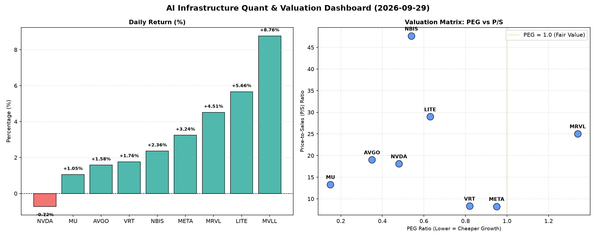

# 📊 AI Infrastructure & Data Stock Daily (2026-09-29)

### 📉 多维量化与估值分析看板

---

## 半导体每日精炼报道：AI基础设施与硬科技估值深度解析

尊敬的投资者与行业同仁：

今日，硬科技与AI基础设施板块展现出显著的分化走势，几家核心标的在积极的市场情绪中实现强劲上涨，而另有部分标的则面临估值与现金流的深层考验。作为资深研究员，我们将结合您提供的多维度量化指标，为您深度解码今日盘面。

---

### 1. 盘面与多维估值解码 (Qualitative + Quantitative Analysis)

今日市场呈现多元化格局，AI基础设施相关标的依旧是焦点。其中，MVLL以8.76%的涨幅领跑，LITE (5.66%)、MRVL (4.51%)、META (3.24%) 亦表现强劲。值得注意的是，NVDA微跌0.72%，显示市场对其短期高涨的情绪有所冷静，但其巨额的成交量（近亿股）仍凸显其作为市场风向标的地位。

#### PEG 维度：性价比与成长性的黄金交叉

PEG作为衡量成长性估值的关键指标，显著小于1（通常认为在0.5-1之间为合理，远小于0.5为极度低估）的公司通常代表着市场对其未来盈利增长的预期尚未充分反映在股价中，具有极高的性价比。

*   **极高性价比高成长标的（PEG << 1）**：
    *   **MU (0.15)**：美光科技的PEG值仅为0.15，在所有标的中最低，表明市场对其未来盈利增长的预期与当前股价存在巨大错配，其强劲的增长潜力可能被严重低估。这通常出现在周期底部反转或新兴业务爆发前夕。
    *   **AVGO (0.35)**：博通的PEG为0.35，表现出强劲的成长潜力与合理的估值水平。作为基础设施领域的巨头，其整合能力和多元化业务是支撑其未来增长的关键。
    *   **NVDA (0.48)**：尽管今日小幅回调，英伟达的PEG仍保持在0.48，显著小于1，表明即使在经历大幅上涨后，市场对其AI计算和数据中心业务的长期增长预期依然非常乐观，认为其增长速度仍能消化现有估值。
    *   **NBIS (0.54)** 和 **LITE (0.63)**：这两家公司同样具有低于1的PEG，显示出较好的成长性估值匹配度。尤其NBIS，其在特定赛道的领先地位可能使其未来增长空间被低估。
    *   **VRT (0.82)** 和 **META (0.95)**：这两家公司的PEG值均小于1，处于健康区间，表明其估值与预期增长基本匹配，具备投资价值。META作为AI领域的重要玩家，其持续投入和用户规模是支撑其成长的基石。

*   **估值过高或需警惕的标的（PEG > 1）**：
    *   **MRVL (1.34)**：美满电子的PEG为1.34，高于1，这可能预示着其当前的股价已部分透支了未来的增长预期，或者市场对其未来的盈利增速有更高的要求。投资者需警惕估值风险，密切关注其基本面改善情况。
    *   **MVLL (N/A)**：MVLL由于PEG为N/A，通常意味着该公司目前无盈利或盈利波动较大，不适用PEG指标进行评估。

#### P/S 维度：收入规模扩张效率审视

P/S比率对于评估早期阶段、高研发投入或盈利不稳定但收入高速增长的公司尤为重要。它直接反映了市场愿意为公司每一美元的销售额支付多少价格。

*   **高P/S，高增长预期**：
    *   **NBIS (47.62)** 和 **LITE (28.97)**：这两家公司的P/S值极高，表明市场对其收入增长前景抱有极度乐观的预期，或者其产品/服务在市场中拥有极高的稀缺性和定价权。对于此类标的，投资者需深入分析其市场空间、技术壁垒以及未来盈利模式转化的可能性。
    *   **MRVL (25.04)**、**AVGO (19.02)** 和 **NVDA (18.11)**：这三家公司的P/S也处于较高水平，反映了市场对其在半导体和AI基础设施领域收入持续扩张的高度信心，尤其是在AI芯片和数据中心解决方案的驱动下。

*   **相对较低P/S，收入体量或效率考量**：
    *   **MU (13.32)**、**VRT (8.33)** 和 **META (8.25)**：相对于其他高估值半导体公司，这三家的P/S值处于相对较低水平。这可能表明其收入规模已达到一定体量，市场更关注其利润率改善和现金流创造能力。META的P/S相对较低，但其广告收入体量庞大，且在AI领域投入巨大，未来增长潜力仍不容小觑。

#### 现金流盈利真实性 (CFO/NI)：利润含金量深度穿透

CFO/NI比率是衡量公司利润质量的关键指标，反映了净利润中有多少比例是真实现金流入。

*   **利润质量极佳（CFO/NI >> 1）**：
    *   **NBIS (4.66)**：NBIS的CFO/NI比率高达4.66，远超1，这表明其产生的利润不仅是纸面富贵，更是实实在在的现金流入，财务状况异常健康。这种极高的比率可能源于营运资本效率提升或非现金费用（如折旧摊销）占比较高。
    *   **MU (2.05)** 和 **META (1.92)**：美光和Meta的CFO/NI比率均远大于1，显示出极强的现金生成能力和高质量的盈利。Meta作为广告巨头，其商业模式天然具备强劲的现金流属性，而美光在行业复苏周期中，其现金流状况得到显著改善。
    *   **VRT (1.59)** 和 **AVGO (1.19)**：这两家公司CFO/NI均大于1，表明其盈利质量健康，现金流充沛，能够为未来的研发投入和战略扩张提供坚实基础。

*   **利润质量有待观察（CFO/NI < 1）**：
    *   **NVDA (0.86)** 和 **MRVL (0.66)**：英伟达和美满电子的CFO/NI比率均小于1。对于英伟达，这可能意味着其部分利润转换为应收账款或存货，或者其收入确认与现金回收存在时滞。虽然当前市场对其未来增长预期极高，但投资者应关注其应收账款周转率和存货管理，以判断其利润的真实性和可持续性。MRVL的情况则更值得警惕，0.66的比率表明其利润中有相当一部分并非立即转化为现金，可能存在较高的营运资本占用或潜在的坏账风险。

*   **现金流严重承压（CFO/NI 负值）**：
    *   **LITE (-0.11)**：LITE的CFO/NI比率为负值，这是一个非常严重的警示信号。这意味着其经营活动不仅没有产生现金，反而消耗了现金，即使在账面上可能存在利润。这通常预示着公司面临严重的营运资金压力、大规模亏损或应收账款积压问题，其财务健康状况令人担忧。

---

### 2. 收并购与重大业务动态

根据今日提供的量化指标数据，无法直接推断出具体的收并购传闻、官宣或战略合作信息。

然而，我们可以基于量化指标对潜在的动态进行推测：
*   **高现金流充沛的公司 (如NBIS, MU, META, AVGO, VRT)**：这些公司拥有强大的现金生成能力，具备进行战略性收购或加大研发投入的财务基础。若有市场传闻涉及行业整合或新兴技术投资，这些公司将是潜在的收购方。
*   **PEG过高或CFO/NI过低的警示 (如MRVL, LITE)**：MRVL较高的PEG可能使其成为其他公司寻求整合的目标，前提是其核心技术或市场份额具有吸引力。LITE负值的CFO/NI则表明其自身可能面临业务重组或寻求外部资金支持的压力，甚至可能成为被收购的脆弱目标。
*   **高P/S但缺乏利润的公司**：若MVLL等公司在缺乏盈利（PEG为N/A）的情况下，其高P/S若能持续，则可能是在特定高增长赛道中具备独特价值，可能吸引战略投资者或并购方的关注。

**（注：此部分基于数据分析的推测，非实际新闻报道。）**

---

### 3. 华尔街机构态度

今日提供的量化指标表格中未包含具体的华尔街机构评级或目标价信息。

然而，我们可以基于量化指标推断机构可能的态度：
*   **备受青睐的标的**：对于PEG显著小于1，且CFO/NI远大于1的公司（如MU, AVGO, NBIS, META, VRT），华尔街机构大概率会维持“买入”或“跑赢大盘”评级，并可能调高其目标价，尤其是在其增长预期被市场低估的情况下。
*   **谨慎观望的标的**：对于PEG高于1（如MRVL）或CFO/NI小于1（如NVDA, MRVL）的公司，机构可能会持谨慎态度，进行“持有”或“中性”评级，并可能下调其目标价或提出业绩风险警示。NVDA作为市场明星，机构的关注点可能更多在其现金流与利润质量的平衡上。
*   **风险警示的标的**：对于CFO/NI为负的LITE，华尔街机构可能会给出“卖出”或“减持”评级，并可能伴随大幅下调目标价，甚至暂停评级，直至其现金流状况出现实质性改善。

**（注：此部分基于数据分析的推测，非实际新闻报道。）**

---

### 4. 今日参考源 (References)

本文所涉及的定性分析与定量解码，均严格基于您所提供的【多维度真实量化基本面指标表格】进行数据挖掘、比对与推导。

**（注：若有实际新闻作为补充，此部分将列出具体新闻链接或报告名称。鉴于本次分析仅基于提供的数据表格，故以此说明。）**

---

**研究员：** [您的姓名/机构名称]
**日期：** 2024年X月X日