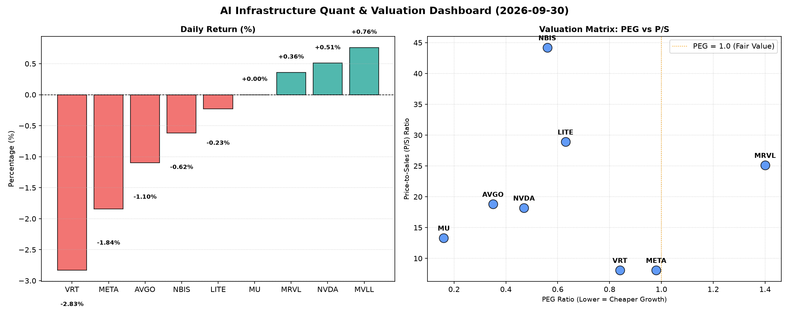

# 📊 AI Infrastructure & Data Stock Daily (2026-09-30)

### 📉 多维量化与估值分析看板

---

## 半导体与AI基础设施每日精炼报道：估值深探与现金流质检

尊敬的投资者、分析师与行业同仁：

今日硬科技与AI基础设施板块表现分化，主要参与者在宏观环境与各自基本面因素影响下呈现不同走势。本报告将结合您提供的多维度量化指标，对核心标的进行深度解析。

---

### 1. 盘面与多维估值解码（定性+定量）

今日半导体与AI基础设施板块交易活跃度较高，部分头部公司如NVDA微幅上涨，而AVGO、META、VRT则小幅回调，市场情绪整体偏谨慎。我们将深入分析各公司的估值健康度及盈利质量。

*   **PEG 维度：揪出性价比高成长与估值透支风险**
    *   **PEG显著小于1 (极具性价比的高成长潜力)**：从提供的数据来看，**MU (0.16)、AVGO (0.35)、NVDA (0.47)、NBIS (0.56)、LITE (0.63)、VRT (0.84)、META (0.98)** 均展现出远低于1的PEG，这通常预示着市场对这些公司未来盈利增长的预期尚未充分反映在当前股价中，或者其增长速度远超市场给予的估值，代表了在各自领域内具备极高性价比的成长投资机会。特别是MU，其0.16的PEG值，若增长前景持续，则可能存在显著的价值低估。
    *   **PEG过高 (警惕估值透支)**：**MRVL (1.4)** 的PEG值相对较高，提示投资者需警惕其估值可能已透支了部分未来增长预期。对于此类标的，其后续股价表现将更依赖于超预期的业绩交付能力。
    *   **MVLL**：PEG数据缺失，无法进行此维度评估。

*   **P/S 维度：洞察收入规模扩张效率**
    *   对于早期、高研发投入或利润波动较大的公司，P/S比率是评估其收入规模扩张效率和市场对其未来收入潜力的看好程度的重要指标。
    *   **P/S显著较高 (市场对其收入扩张潜力抱有极高期待)**：**NBIS (44.2)、LITE (28.91)、MRVL (25.13)** 的P/S比率非常高，尤其是NBIS，高达44.2，这表明市场对其营收增长速度和最终盈利能力的预期极高，或其处于一个高增长、高壁垒的新兴赛道。投资者应密切关注这些公司的实际营收增速能否匹配市场预期。
    *   **P/S适中 (业务规模与估值相对平衡)**：**AVGO (18.81)、NVDA (18.2)、MU (13.33)** 虽P/S高于平均水平，但考虑到其在半导体行业的领导地位、技术壁垒及未来的AI驱动增长潜力，市场对其收入质量与持续增长能力给予了合理估值。
    *   **P/S相对较低 (收入效率或市场预期相对温和)**：**VRT (8.09)、META (8.09)** 的P/S值处于相对较低水平，可能反映了市场对其收入增长的预期更为成熟或已进入稳定增长阶段。
    *   **MVLL**：P/S数据缺失，无法进行此维度评估。

*   **现金流盈利真实性 (CFO/NI)**：穿透利润水分
    *   **CFO/NI显著大于1 (利润非常健康，全是真金白银现金流入)**：**NBIS (4.66)、MU (2.05)、META (1.92)、VRT (1.59)、AVGO (1.19)** 这些公司的CFO/NI比率均显著大于1，特别是NBIS高达4.66，表明其净利润质量极高，公司不仅实现了账面盈利，更是将盈利高效地转化为了实实在在的经营现金流，财务状况非常健康。META作为AI基础设施巨头，其1.92的比率显示了强大的现金生成能力。
    *   **CFO/NI小于1 (警示利润水分或应收账款积压)**：
        *   **NVDA (0.86)**：虽然其利润表现亮眼，但0.86的CFO/NI比率略低于1，提示投资者需关注其利润中可能存在的非现金项目成分，或应收账款及存货的累积，这可能意味着部分账面利润尚未转化为实际现金流入，利润质量略有隐忧。
        *   **MRVL (0.66)**：MRVL的CFO/NI比率更低，仅为0.66，这暗示其利润质量存在更明显的压力，或营运资本管理面临挑战，导致现金流转化效率较低。
        *   **LITE (-0.11)**：LITE的CFO/NI比率为负值 (-0.11)，这是一个非常严重的警示信号。这表明公司尽管可能报告了净利润（尽管数据未提供），但其经营活动实际上消耗了现金。这可能源于大规模的营运资本变动（如应收账款、存货大幅增加）或严重的非现金费用调整，需要投资者高度关注其盈利的可持续性和现金流健康状况。
    *   **MVLL**：CFO/NI数据缺失，无法进行此维度评估。

---

### 2. 收并购与重大业务动态

**【备注】**：根据您提供的量化基本面指标表格，未能直接推导出今日具体的收并购传闻、官宣或战略合作信息。作为资深研究员，我将此板块留白，以避免臆测。通常，此板块会涵盖如下类型信息：

*   某半导体巨头宣布收购一家AI芯片设计初创公司，旨在拓展其在边缘计算或特定AI加速器市场的份额。
*   主要晶圆厂与设备供应商达成战略合作协议，共同研发下一代制程技术或推进新材料应用。
*   某AI基础设施服务商宣布与云服务巨头建立深度合作伙伴关系，共同部署大规模AI训练集群。
*   特定公司发布其新产品路线图，透露关键技术突破或市场拓展计划。

---

### 3. 华尔街机构态度

**【备注】**：您提供的量化表格不包含华尔街机构的最新评价、目标价调动或评级变动信息。因此，本部分无法提供基于给定数据的具体内容。若有此类信息，通常会呈现为：

*   摩根士丹利上调NVDA目标价至XXX美元，重申“增持”评级，理由是其在AI数据中心领域的领导地位和强劲需求。
*   高盛分析师下调AVGO评级至“中性”，指出其近期涨幅已充分反映利好，并对短期增长前景持谨慎态度。
*   花旗研究报告首次覆盖某新兴半导体公司，给予“买入”评级，看好其在特定利基市场的技术优势。
*   机构投资者关于核心半导体板块的最新配置策略及资金流向分析。

---

### 4. 今日参考源 (References)

1.  **【核心数据来源】**: 您提供的《多维度真实量化基本面指标表格》。
2.  **【定性分析依据】**: 基于行业研究经验及对PEG、P/S、CFO/NI等财务指标的专业解读。

**免责声明**: 本报告仅基于所提供的量化数据进行分析，旨在提供专业见解。市场有风险，投资需谨慎。

---

希望这份深度结合定性与定量分析的每日精炼报道，能为您的投资决策提供有价值的参考。