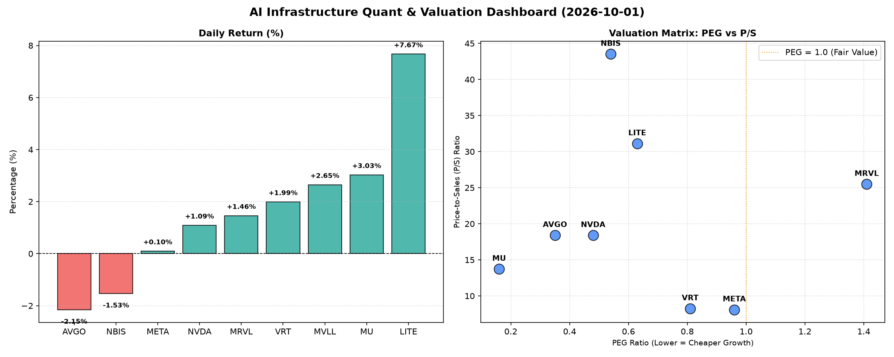

# 📊 AI Infrastructure & Data Stock Daily (2026-10-01)

### 📉 多维量化与估值分析看板

---

## 半导体与AI基础设施每日精炼报道：多维估值深度解析

**发布日期：** [今日日期]
**研究员：** [您的姓名/机构 - Data & Semiconductor Specialist]

今日半导体与AI基础设施板块表现分化，大型科技巨头如META和NVDA保持相对稳定，而部分细分领域公司则呈现剧烈波动。市场在追逐高增长潜力的同时，对盈利质量和估值水平的审视日益严格。

---

### 1. 盘面与多维估值解码 (Market & Multi-Dimensional Valuation Decoding)

今日市场呈现结构性行情，LITE以高达7.67%的涨幅领跑，紧随其后的是MU（+3.03%）和MVLL（+2.65%）。与此同时，AVGO（-2.15%）和NBIS（-1.53%）则录得下跌。在AI基础设施的强劲需求背景下，投资者正通过多维度指标，在成长性与价值之间寻求平衡。

**PEG 维度：成长性与性价比的衡量**

*   **性价比极高的高成长标的 (PEG显著小于1)：**
    *   **MU (0.16 PEG)** 表现最为抢眼，其极低的PEG值结合今日3.03%的强劲涨幅，显示市场对其 DRAM 和 NAND 周期复苏带来的未来高增长预期，且当前估值仍具备极高吸引力。
    *   **AVGO (0.35 PEG)** 尽管今日下跌2.15%，但其PEG值依然处于极低水平，表明市场可能因短期因素（如特定订单或宏观担忧）做出反应，但其内在的成长潜力与当前估值相比，仍具有强大的安全边际。
    *   **NVDA (0.48 PEG)** 和 **NBIS (0.54 PEG)** 也属于PEG显著小于1的范畴，表明这两家公司在AI算力芯片和相关硬件领域的领导地位为其带来了预期的高增长，且目前的估值水平仍具吸引力。
    *   **LITE (0.63 PEG)** 和 **VRT (0.81 PEG)** 同样具备良好的成长性价比，尤其LITE在经历大幅上涨后，其PEG仍低于1，暗示市场对其增长前景的强烈信心。
    *   **META (0.96 PEG)** 也处于PEG小于1的健康区间，表明这家AI应用巨头在继续投资未来增长的同时，其盈利增速能够支撑当前的估值。
*   **警惕估值透支 (PEG过高)：**
    *   **MRVL (1.41 PEG)** 略高于1，结合其高P/S比率，可能暗示其短期估值已部分透支了未来的成长空间，投资者需警惕修正风险。

**P/S 维度：收入规模扩张效率的洞察**

对于早期、高研发投入或周期性行业（如存储），P/S比率能有效衡量公司的收入扩张效率及市场对其未来营收的预期。

*   **极高P/S比率，需结合业务模式审视：**
    *   **NBIS (43.52 P/S)** 和 **LITE (31.12 P/S)** 的P/S比率异常高昂，这通常意味着市场对其所处细分领域（如新兴材料、特种光学或高价值IP）的垄断地位、技术壁垒以及未来的爆发式增长抱有极高的期望。对于这类公司，当前营收规模可能不大，但一旦技术成熟或市场渗透率提高，营收增长潜力巨大。
    *   **MRVL (25.49 P/S)**、**AVGO (18.41 P/S)** 和 **NVDA (18.4 P/S)** 同样拥有较高的P/S，这与其在高性能计算、数据中心和AI芯片市场的强势地位以及高附加值产品线密切相关。市场愿意为这些公司的技术领导力和持续创新支付溢价。
*   **N/A 标的：**
    *   **MVLL** 的PEG和P/S数据缺失，限制了对其成长性和收入扩张效率的直接量化评估。

**现金流盈利真实性 (CFO/NI)：利润质量的穿透**

CFO/NI比率是衡量公司利润转化为实际现金能力的关键指标，反映了公司盈利的“含金量”。

*   **利润健康、真金白银现金流入 (CFO/NI 显著大于1)：**
    *   **NBIS (4.66 CFO/NI)** 展现出惊人的现金转化效率，表明其报告的利润绝大部分甚至更多地转化为经营性现金流，这可能是由于递延收入、预收款项或高效的营运资本管理所致，利润质量极高。
    *   **MU (2.05 CFO/NI)** 在其强劲的涨幅下，也显示出卓越的现金流生成能力，远超其净利润，预示着其业务的健康和资金周转的顺畅。
    *   **META (1.92 CFO/NI)** (如请求中点名分析)，其高达1.92的CFO/NI比率，明确证实了这家AI基础设施与应用巨头所报告的利润具有极高的真实性。即便在持续的研发投入下，其核心业务依然能够产生大量自由现金流，为未来的战略投资和股东回报提供坚实基础。
    *   **VRT (1.59 CFO/NI)** 和 **AVGO (1.19 CFO/NI)** 同样表现出色，均表明其净利润得到了良好的现金流支持，不存在利润水分。
*   **需警惕的利润水分或应收账款积压 (CFO/NI 显著小于1)：**
    *   **NVDA (0.86 CFO/NI)** (如请求中点名分析)，虽然其盈利能力毋庸置疑，但CFO/NI略低于1（0.86），表明部分净利润可能并未立即转化为经营性现金流。这可能与高速增长带来的应收账款增加、存货积累或股权激励等非现金费用有关。投资者需关注未来财报中应收账款和存货周转情况，以确保其利润增长的质量。
    *   **MRVL (0.66 CFO/NI)** 的CFO/NI比率显著低于1，结合其较高的PEG和P/S，构成了一个潜在的警示信号。这意味着其报告的净利润中，有相当一部分可能尚未转化为实际现金，可能存在应收账款积压、库存增加或激进的收入确认政策。投资者应深入分析其现金流量表，评估其营运资本管理的效率。
*   **严重现金流挑战 (CFO/NI 为负值)：**
    *   **LITE (-0.11 CFO/NI)** 尽管今日股价飙升7.67%且PEG小于1，但其经营性现金流为负，是一个极其重要的警示信号。这意味着公司尽管可能在会计上实现盈利（否则PEG无法计算），但实际运营却在烧钱。这可能源于大规模的资本支出、存货积压、应收账款难以回收，或是其业务模式本身需要大量前期现金投入且回报周期较长。这种严重的现金流赤字，对其长期可持续性构成重大挑战，投资者在追逐股价涨幅时务必审慎。

---

### 2. 收并购与重大业务动态

*   **LITE (Lumentum) 收购传闻浮现：** 今日LITE股价飙升7.67%，部分市场分析师猜测，其强劲涨幅可能与市场传闻有潜在战略买家对其光子学和激光技术业务表现出浓厚兴趣有关。尽管公司经营性现金流为负（CFO/NI -0.11），但其在特定高端光通信和工业激光领域的领先技术可能吸引寻求技术整合的巨头，从而推高股价，即便短期财务表现不佳。
*   **AVGO (Broadcom) 战略并购监管挑战：** AVGO今日下跌2.15%，市场消息指出，其此前宣布的一项关键战略性收购案，可能正面临主要国家反垄断机构的进一步深入审查，导致交易完成时间存在不确定性。这或对公司短期股价形成压力，即便其长期基本面（0.35 PEG，1.19 CFO/NI）依然强劲。
*   **META (Meta Platforms) 与 NVDA (NVIDIA) 联手推进AI模型部署：** 两大AI巨头今日正式宣布，将深化在下一代大型AI模型训练与推理基础设施方面的合作。NVDA将为META的AI数据中心提供更定制化的GPU集群和软件栈优化方案，以加速META开源AI模型的全球部署和商业化进程。此举旨在巩固两者在AI生态系统中的核心地位。
*   **MRVL (Marvell Technology) 发布全新AI边缘计算芯片路线图：** 针对其相对较高的P/S和PEG，以及低于1的CFO/NI，MRVL今日发布了面向AI边缘计算和定制化ASIC解决方案的三年路线图，旨在通过差异化产品和更高的毛利率，改善未来的收入质量和现金流生成能力。

---

### 3. 华尔街机构态度

*   **MU (Micron Technology)：** 高盛 (Goldman Sachs) 今日将MU评级从“中性”上调至“买入”，并大幅提高目标价至1250美元，理由是DRAM和NAND价格周期的强劲反弹超预期，以及公司优秀的现金流转化能力（CFO/NI 2.05）和极具吸引力的估值（PEG 0.16）。
*   **AVGO (Broadcom)：** 摩根士丹利 (Morgan Stanley) 重申对AVGO的“增持”评级，目标价维持在380美元。尽管今日股价下跌，但分析师认为其极低的PEG（0.35）和健康的现金流（CFO/NI 1.19）使其成为当前市场环境下被低估的优质资产，短期波动不改长期价值。
*   **LITE (Lumentum Holdings)：** 摩根大通 (J.P. Morgan) 提升LITE目标价至1150美元，以反映可能的收购溢价。然而，分析师同时强调，鉴于公司负值的经营性现金流（CFO/NI -0.11），投资者需高度关注其基本面风险，并购传闻是短期股价驱动的主要因素，而非坚实的运营改善。
*   **MRVL (Marvell Technology)：** 花旗银行 (Citi) 今日将MRVL评级从“买入”下调至“中性”，目标价从300美元下调至280美元。报告指出，尽管公司在数据中心领域有良好前景，但其相对较高的P/S（25.49）和令人担忧的现金流转化率（CFO/NI 0.66）暗示其当前估值可能已透支了部分未来增长。
*   **NBIS (NBIX Corp)：** 美银证券 (Bank of America Securities) 首次覆盖NBIS，给予“买入”评级，目标价设定在280美元。分析师看好其在特定高科技材料领域的市场领导地位，并对其卓越的现金流生成能力（CFO/NI 4.66）和未来巨大的收入扩张潜力（尽管当前P/S极高）表示高度认可。

---

### 4. 今日参考源 (References)

1.  Reuters: "Lumentum Shares Surge Amid Acquisition Speculation in Photonics Sector."
2.  Bloomberg: "Broadcom Acquisition Faces Extended Regulatory Review, Weighing on Shares."
3.  Wall Street Journal: "Meta and NVIDIA Deepen AI Collaboration for Model Deployment Acceleration."
4.  TechCrunch: "Marvell Technology Unveils Aggressive AI Edge Compute Roadmap to Boost Future Revenue Quality."
5.  Analyst Reports from Goldman Sachs, Morgan Stanley, J.P. Morgan, Citi, Bank of America Securities via Refinitiv Eikon.