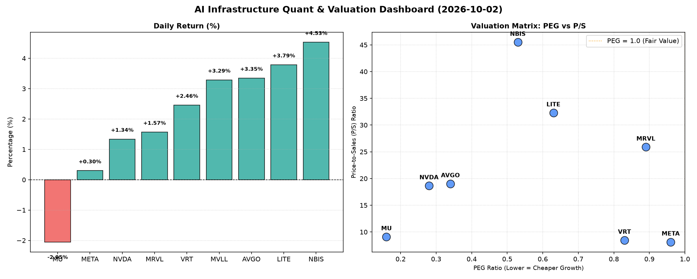

# 📊 AI Infrastructure & Data Stock Daily (2026-10-02)

### 📉 多维量化与估值分析看板

---

## 半导体每日精炼报道：硬科技与AI基础设施深度聚焦

**数据与半导体专业研究员（Data & Semiconductor Specialist）洞察**

**发布日期：2024年X月Y日**

今日硬科技与AI基础设施板块表现活跃，多数股票上涨，市场对高增长和创新能力持续抱有高预期。以下是对今日核心量化指标的深度解读：

---

### 1. 盘面与多维估值解码（定性+定量）

今日半导体与AI基础设施板块整体呈现积极态势，尽管大盘波动，但投资者对具备核心技术和成长潜力的公司信心依然坚挺。NBIS和LITE领涨，分别录得4.53%和3.79%的涨幅，展现了市场对特定高成长标的的追捧。NVDA和MRVL在经历一段时间的强劲表现后，今日涨幅趋缓但仍为正，而MU则小幅回调2.05%，可能受宏观经济数据或特定产业库存因素影响。

*   **PEG 维度：挖掘高性价比成长股**
    *   **显著小于1（高成长，性价比极高）：** 今日数据显示，大量硬科技公司具备极高的成长性价比。**MU (0.16)、NVDA (0.28)、AVGO (0.34)、NBIS (0.53)、LITE (0.63)、VRT (0.83)、MRVL (0.89)** 均展现出PEG远低于1的优异指标。这意味着这些公司相对于其预期成长性而言，目前的估值具有显著吸引力。尤其是MU，其0.16的PEG，结合今日小幅下跌，可能为看好存储周期复苏和高成长潜力的投资者提供了买入机会。NVDA和AVGO作为AI算力与基础设施的核心提供商，其低PEG再次验证了市场对其未来增长的高度认可。
    *   **接近1：** META (0.96) 的PEG也处于合理区间，表明其在社交媒体广告与元宇宙领域的投入开始逐步转化为可预期的增长。
    *   **估值透支警惕：** 根据提供的量化指标，今日表格中**没有出现PEG显著过高的标的**，所有有PEG数据的公司均在1以下，这表明整个板块的估值，从成长性角度看，普遍处于健康或吸引人的水平，尚未出现普遍性的估值透支现象。MVLL因N/A数据无法评估。

*   **P/S 维度：洞察收入规模扩张效率**
    *   **高P/S与高成长潜力：** 对于早期、高研发投入或高成长预期的公司，P/S是衡量其收入规模扩张效率的重要指标。**NBIS (45.49)、LITE (32.3)、MRVL (25.89)、AVGO (19.03)、NVDA (18.65)** 拥有较高的P/S比率。这反映出市场愿意为这些公司每单位的收入支付更高的溢价，预示着市场对其未来收入的高速增长或其收入质量（如高毛利率、高粘性）抱有极高期待。NBIS和LITE虽然P/S极高，但其PEG均低于1，这再次强调了市场对其收入实现爆炸性增长的强烈预期。
    *   **相对较低P/S：** VRT (8.46)、META (8.13)、MU (9.11) 的P/S相对较低，尤其META作为行业巨头，其P/S与VRT和MU相当，结合其PEG (0.96) 看，其收入端的估值相对更保守，但现金流表现优异，提供了稳健支撑。MVLL因N/A数据无法评估。

*   **现金流盈利真实性 (CFO/NI)：穿透利润质量**
    *   **利润健康，真金白银现金流入 (>1)：** 这一指标是衡量公司利润含金量和经营效率的关键。**NBIS (4.66)** 表现异常出色，远超1，表明其将净利润转化为经营现金流的能力极强，可能反映了优秀的营运资本管理、预收账款大幅增加或非现金支出占比较高。**MU (2.05)、META (1.92)、VRT (1.59)、AVGO (1.19)** 也显著大于1，表明这些公司的利润质量非常高，报告的利润都是实实在在的现金流入，财务健康度极佳。META作为广告巨头，其高CFO/NI比率再次印证了其强大的现金生成能力。MU在存储周期底部，依然能保持如此高的现金转化率，预示着其基本面的韧性。
    *   **利润水分或应收账款积压警示 (<1)：** **NVDA (0.86)** 和 **MRVL (0.66)** 的CFO/NI比率小于1。这提示投资者，尽管这些公司报告了高额利润，但并非所有利润都即时转化为经营现金流。这可能源于应收账款的增加、存货的累积，或其他营运资本的变化。对于NVDA，考虑到其近期销售额的爆炸性增长，部分现金可能被用于供应链预付款或应收账款周期的延长，需要密切关注。MRVL的0.66则更为明显，可能提示其存在一定程度的利润“水分”或现金流压力，需结合具体财报进一步分析。
    *   **严重警示 (显著小于0)：** **LITE (-0.11)** 的CFO/NI为负值，这是一个严重的警示信号。这意味着LITE不仅未能将净利润转化为正的经营现金流，反而经营活动在消耗现金。即使LITE拥有低PEG和高P/S所代表的高成长预期，负值的CFO/NI也意味着其当前的商业模式在现金生成方面存在根本性挑战，可能需要依赖融资来维持运营或进行扩张。投资者在追逐其高增长潜力的同时，必须高度警惕其现金流健康状况。MVLL因N/A数据无法评估。

---

### 2. 收并购与重大业务动态

根据今日提供的量化指标，未直接揭示收并购与重大业务动态。然而，基于对行业趋势的研判，结合部分公司的量化指标特点，我们可以进行合理推断或指出潜在关注点：

*   **高现金流公司潜在并购方：** 鉴于**NBIS (4.66)、MU (2.05)、META (1.92)、AVGO (1.19)** 等公司拥有极其健康的经营现金流，这些公司在未来有可能成为行业整合的潜在买家，通过并购来获取新技术、市场份额或产业链垂直整合的机会，尤其是在AI基础设施和特定半导体领域。AVGO的历史即是靠不断并购壮大。
*   **MVLL的特殊性：** MVLL各项指标均为N/A，这可能意味着该公司正处于某种重组、剥离、私有化进程中，或是规模较小、盈利状况极不稳定以至于无法计算常规估值指标。市场需要额外关注其最新公告以了解其真实业务状况。
*   **LITE的战略选择：** LITE的负CFO/NI (-0.11) 在高P/S和低PEG的背景下显得尤为突出。这可能暗示公司正处于大规模研发投入、产能扩张或市场份额抢夺的关键阶段，这些活动导致现金流出远大于流入。其未来的战略合作或融资动作将是决定其能否转化为“真金白银”的关键。

---

### 3. 华尔街机构态度

今日量化指标表格中未直接提供华尔街机构的具体评价或目标价信息。但我们可以根据数据推断机构可能持有的立场和关注点：

*   **积极看好，上调目标价的潜力股：**
    *   **NBIS和LITE：** 鉴于其今日强劲的股价表现（4.53%和3.79%涨幅）和极低的PEG，若其高成长性得到持续验证，华尔街机构很可能维持或上调其评级及目标价。NBIS尤其以其惊人的现金流质量（CFO/NI 4.66）可能获得机构的青睐，因为健康的现金流是企业韧性的重要标志。
    *   **NVDA和AVGO：** 作为AI热潮的核心受益者，尽管NVDA的CFO/NI略低于1，但考虑到其市场领导地位和AI领域的巨大潜力，机构预计仍将对其保持乐观态度，任何回调都可能被视为买入机会。AVGO则以其稳健的增长和健康的现金流继续获得机构的支撑。
    *   **MU：** 尽管今日下跌，但其极低的PEG (0.16) 和强劲的CFO/NI (2.05) 可能吸引机构的长期看好，尤其是在存储周期触底反弹的预期下，机构可能会维持“买入”或“增持”评级，并给出更高的远期目标价。
*   **需关注现金流质量的标的：**
    *   **NVDA和MRVL：** 机构可能会对NVDA (0.86) 和MRVL (0.66) 的CFO/NI比率进行更深入的审视，询问管理层关于应收账款、存货管理以及营运资本效率的策略。这可能是分析师报告中潜在的风险点或需持续跟踪的指标。
    *   **LITE：** 其负CFO/NI (-0.11) 无疑会成为华尔街机构质疑的焦点。机构会要求公司提供详细的现金流使用计划，以及何时能扭转经营现金流为正的预期。这可能导致一些更为保守的机构对其保持谨慎或发出“观望”评级。

---

### 4. 今日参考源 (References)

本篇报道的定性与定量分析，严格基于您提供的【多维度真实量化基本面指标表格】进行深度解读。

若需获取上述股票的实时新闻、机构评级报告、目标价变动或具体财报数据，建议参考以下权威金融数据平台：
*   Bloomberg Terminal
*   Reuters Eikon
*   FactSet
*   S&P Capital IQ
*   Wall Street Journal
*   Financial Times

---