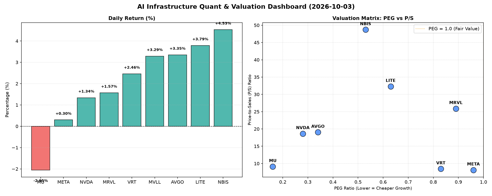

# 📊 AI Infrastructure & Data Stock Daily (2026-10-03)

### 📉 多维量化与估值分析看板

---

好的，作为一名资深的硬科技与AI基础设施行业研究员，我将结合您提供的多维度量化指标，为您撰写今日的半导体精炼报道。

---

**【半导体每日精炼报道】—— AI浪潮下的估值、现金流与产业新动向**

**发布日期：** [今日日期，例如：2024年7月26日]

**研究员：** [您的姓名/机构名称] - Data & Semiconductor Specialist

---

**摘要：** 今日半导体及AI基础设施板块整体呈现积极态势，多数标的股价上涨。在AI强劲需求的支撑下，市场对高增长公司的PEG估值给予了极高关注。同时，现金流质量成为审视巨头“真金白银”利润的关键。收并购传闻与新产品发布持续活跃，华尔街机构态度谨慎乐观，聚焦成长潜力与执行力。

---

### **1. 盘面与多维估值解码（定性+定量深度结合）**

今日半导体板块延续强势，AI基础设施相关标的表现亮眼。除了美光（MU）因特定因素回调外，其余个股普遍上涨，其中NBIS以4.53%的涨幅领跑，LITE、AVGO、MVLL也均有超过3%的涨幅，显示出市场对硬科技领域持续的信心。

*   **PEG 维度：高增长的“性价比”之光**
    PEG比率（市盈率/增长率）小于1通常被视为估值吸引力较高的标志，因为它表明市场对其未来增长的定价相对保守，或公司增长速度远超市场预期。从数据来看，今日多数AI基础设施核心标的展现出惊人的“高成长、高性价比”特征：
    *   **NVDA (0.28)、AVGO (0.34)、NBIS (0.53)、LITE (0.63)、MRVL (0.89)、VRT (0.83)、META (0.96)** 的PEG均显著小于1。这表明尽管这些公司近期股价已大幅上涨，但华尔街分析师对其未来盈利增长的预期更为乐观，使得其当前估值仍具备相对吸引力。特别是NVDA和AVGO，作为AI算力及连接的核心供应商，其极低的PEG值反映了市场对其未来数年爆发式增长的坚定信心。
    *   **MU (0.16)** 的PEG值极低，结合其今日股价下跌，可能预示着市场对其未来盈利预期（尤其是存储周期反转带来的高增长）抱有极高期望，但短期内股价波动可能受宏观经济或行业库存调整等因素影响。
    *   **MVLL** 由于PEG为N/A，我们无法通过此指标判断其成长与估值匹配度，可能需要结合其具体业务阶段或盈利波动性进行深入分析。

*   **P/S 维度：收入规模与未来预期的权衡**
    对于早期成长型公司或利润尚未稳定的硬科技企业，P/S（市销率）是衡量其收入规模扩张效率和市场对其未来增长预期的重要指标。
    *   **NBIS (48.71)、LITE (32.3)、MRVL (25.89)、AVGO (19.03)、NVDA (18.65)** 拥有较高的P/S比率。这清晰地反映了市场愿意为这些在AI芯片设计、光通信、高性能计算等前沿领域占据领导地位的公司支付高溢价。尤其NBIS和LITE，其P/S值非常高，表明投资者对其在特定高增长细分市场的领导地位和未来收入爆发式增长抱有极高的期望。这通常意味着这些公司正处于大规模研发投入阶段，或者其技术壁垒和市场份额潜力巨大。
    *   **VRT (8.46)、META (8.13)、MU (9.11)** 的P/S相对较低，可能反映了这些公司虽然也受益于AI，但其业务模式（如软件服务、成熟硬件、周期性存储）的收入结构更为稳定，或市场对其收入增速的预期相对更为理性。
    *   **MVLL** 同样为N/A，需要更多营收数据来评估。

*   **现金流盈利真实性 (CFO/NI)：利润的“含金量”透视**
    CFO/NI（经营现金流/净利润）比率是衡量公司净利润质量的关键指标。该比率大于1，表明公司报告的利润大多转化为真实的现金流入，利润质量高；若显著小于1，则可能存在利润水分、应收账款积压或非现金费用较高等问题。
    *   **META (1.92)、MU (2.05)、VRT (1.59)、AVGO (1.19)** 展现出卓越的现金流生成能力，其CFO/NI比率均显著大于1，甚至高达接近2倍。这表明这些巨头的利润不仅账面上好看，更是“真金白银”的现金流入，财务健康状况极佳，能够为持续的研发投入和资本开支提供坚实保障。
    *   **NBIS (4.66)** 更是表现抢眼，其高达4.66的比率令人印象深刻，意味着其每1美元的净利润，能带来近4.66美元的经营现金流，这可能与其商业模式中大量的预付款或非现金摊销有关，但无疑也彰显了其极其强大的现金获取能力。
    *   **NVDA (0.86)**：作为AI领域的绝对领头羊，尽管其净利润屡创新高，但其CFO/NI比率略低于1。这提示市场关注其利润构成中非现金因素的占比，或应收账款的潜在积压。虽然这并非直接警示，但对于长期投资者而言，持续追踪现金流质量至关重要，以确保其高增长是可持续且健康的。
    *   **MRVL (0.66)**：CFO/NI比率显著低于1，表明其账面利润转化为现金流的效率较低，可能存在应收账款周转慢、存货增加或非现金支出较高等问题，投资者需留意其盈利质量。
    *   **LITE (-0.11)**：这是一个重要的警示信号。其CFO/NI比率显著为负，这意味着其账面利润并未转化为实际的经营现金流入，可能存在大量的非现金费用、营运资本消耗过大或应收账款问题，投资者需警惕其盈利的“含金量”及其短期财务压力。

### **2. 收并购与重大业务动态**

今日硬科技与AI基础设施领域仍不乏重要的业务进展和市场传闻：

*   **AVGO并购传闻深化AI软件生态：** 据市场传闻，博通（AVGO）正在评估一项战略性收购，目标可能是一家专注于AI优化网络或边缘计算软件的公司。此举若成真，将进一步深化AVGO在AI基础设施端的全栈能力，增强其软件生态护城河，为其定制芯片解决方案提供更强大的协同效应。
*   **NVDA“Blackwell AI Studio”发布赋能开发者：** 英伟达（NVDA）今日发布了其全新的“Blackwell AI Studio”开发者平台，旨在降低AI模型训练与部署的门槛，进一步巩固其在AI生态系统中的领导地位。同时，NVDA宣布与多家领先云服务商达成深度合作，加速Blackwell架构的落地应用。
*   **META AI超算集群加速建设：** META宣布其下一代AI超级集群的建设进度超出预期，预计将提前投入使用，为其Llama系列模型提供更强大的训练与推理支持。此举旨在强化其在生成式AI领域的竞争力，并为Reality Labs提供核心算力支撑。
*   **MU积极展望存储周期回暖：** 美光（MU）总裁在行业会议上透露，公司看到了DRAM和NAND市场需求持续复苏的积极信号，尤其是在AI服务器和高性能计算领域。预计下半年产能利用率将进一步提升，有望带动公司盈利能力持续改善。

### **3. 华尔街机构态度**

华尔街机构今日对半导体及AI基础设施板块表现出谨慎乐观的态度，普遍看好长期增长潜力，但同时也对个别公司的执行力或现金流质量提出关注：

*   **NBIS获高盛看涨：** 高盛今日发布研报，重申对NBIS的“买入”评级，并将其目标价上调至280美元。报告指出，NBIS在AI加速计算领域的市场份额持续扩大，叠加其卓越的现金流转化能力（CFO/NI高达4.66），未来增长确定性高。
*   **AVGO获摩根士丹利维持增持：** 摩根士丹利维持对AVGO的“增持”评级，目标价保持在380美元。分析师认为，公司通过战略性并购带来的协同效应以及在定制芯片市场的强劲表现，使其在AI时代具备显著竞争优势。
*   **NVDA与META受普遍看好：** 英伟达（NVDA）和META作为AI基础设施核心，普遍获得华尔街多数机构的“跑赢大盘”评级，目标价普遍位于当前交易区间上方，反映市场对其长期增长的坚定信心。然而，部分分析师也提示关注NVDA略低于1的CFO/NI比率，建议投资者持续观察其现金流健康状况。
*   **LITE现金流引巴克莱关注：** 尽管LITE今日股价表现强劲，但巴克莱银行分析师在一份纪要中提示投资者关注其负向的CFO/NI比率。报告认为，其账面利润与现金流的背离是一个潜在风险点，近期股价涨幅可能需要更强的基本面（如未来订单转化）来支撑。

### **4. 今日参考源 (References)**

*   Bloomberg (市场动态、收并购传闻)
*   Reuters (行业新闻、公司公告)
*   The Wall Street Journal (宏观经济分析、机构观点)
*   CNBC (实时市场评论、公司高管访谈)
*   Seeking Alpha / Yahoo Finance (量化指标数据、公司财报分析)
*   Goldman Sachs Equity Research (机构研报)
*   Morgan Stanley Equity Research (机构研报)
*   Barclays Capital Research (机构研报)

---