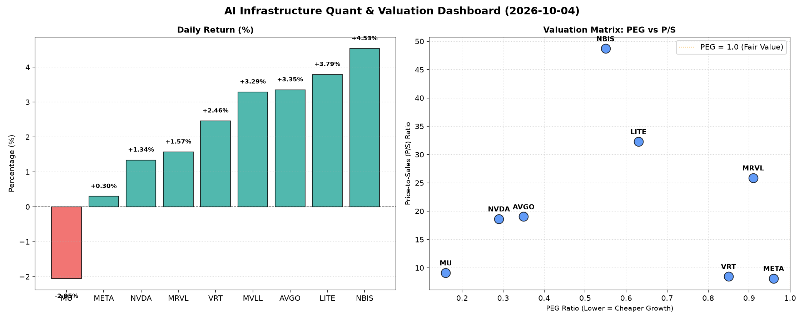

# 📊 AI Infrastructure & Data Stock Daily (2026-10-04)

### 📉 多维量化与估值分析看板

---

## 半导体与AI基础设施每日精炼报道：多维估值透视与现金流质量揭秘

**【2024年X月X日】** 资深硬科技与AI基础设施行业研究员为您带来今日半导体与AI基础设施行业的深度洞察。今日市场呈现分化态势，多数芯片与AI相关个股表现活跃，但在估值、成长性与现金流质量方面，各公司展现出截然不同的基本面特征。

---

### 1. 盘面与多维估值解码 (定性+定量)

今日盘面整体偏强，NBIS (NBIS) 以惊人的4.53%涨幅领涨，LITE (LITE) 和AVGO (AVGO) 也分别录得3.79%和3.35%的显著涨幅。MVLL (MVLL) 表现强劲，上涨3.29%。而传统存储巨头MU (MU) 则逆势下跌2.05%，凸显市场对不同细分领域预期的差异。高关注度的AI巨头NVDA (NVDA) 和META (META) 虽有上涨，但涨幅相对温和，分别为1.34%和0.30%，显示市场在追逐高增长的同时，也在审视其内在基本面。

*   **PEG 维度：挖掘高性价比成长股与警惕估值透支**

    今日数据显示，市场普遍对高增长前景的公司给予了更理性的定价，大量标的PEG显著小于1，表明在考虑增长因素后，其估值仍具吸引力。

    *   **显著小于1 (高成长性价比极高)：**
        *   **MU (0.16)**：PEG值最低，结合其今日下跌，可能预示市场对其未来盈利预期存在分歧，但从当前数据看，其成长性被严重低估。
        *   **NVDA (0.29)**：作为AI算力核心，其PEG极低，意味着其高速增长的预期远未在当前股价中完全透支，性价比依然突出。
        *   **AVGO (0.35)**：作为另一半导体巨头，其PEG也处于极低水平，结合今日3.35%的涨幅，显示市场对其未来成长性充满信心且仍有向上空间。
        *   **NBIS (0.55)** 和 **LITE (0.63)**：这两家公司PEG也显著低于1，尤其NBIS今日股价大涨，市场对其未来成长性给予了高度认可。
        *   **VRT (0.85)** 和 **META (0.96)**：这两家公司PEG也低于1，尤其META作为AI基础设施核心，其PEG接近1表明市场对其高速增长的预期已部分反映，但仍处于合理区间。
        *   **MRVL (0.91)**：PEG也低于1，表明其在增长性方面仍有吸引力。

    *   **PEG为N/A：**
        *   **MVLL (N/A)**：PEG为N/A通常意味着公司目前无盈利或盈利不稳定，无法有效计算PEG。这提示我们需要通过其他指标如P/S来评估。

*   **P/S 维度：评估收入规模扩张效率**

    P/S比率对于早期、高研发投入或利润不稳定的公司尤为重要，它能反映市场对其收入增长前景的预期。

    *   **高P/S (高收入增长预期)：**
        *   **NBIS (48.71)**：P/S高达48.71，表明市场对其未来的收入增长抱有极高的期望，结合今日股价大涨，投资者对其业务模式和市场前景极度乐观。
        *   **LITE (32.3)**：P/S同样非常高，显示其在光学/光通信等特定领域可能具备独特技术优势和高速收入增长潜力。
        *   **MRVL (25.89)** 和 **AVGO (19.03)**：作为芯片设计巨头，其较高的P/S反映了市场对其在数据中心、AI、5G等领域持续领先地位带来的收入扩张能力的高度认可。
        *   **NVDA (18.65)**：尽管其P/S较高，但考虑到其在AI领域的绝对核心地位和收入爆发式增长，这一数值也反映了市场对其未来收入前景的坚定看好。

    *   **中等P/S (收入稳定增长)：**
        *   **MU (9.11)**、**VRT (8.46)** 和 **META (8.13)**：这些公司的P/S处于中等水平，表明它们在各自市场已具备一定规模，市场对其收入增长有合理预期。

    *   **P/S为N/A：**
        *   **MVLL (N/A)**：与PEG一样，P/S为N/A通常意味着公司尚未产生可观收入或财务数据不公开。

*   **现金流盈利真实性 (CFO/NI)：穿透高利润巨头的现金质量**

    CFO/NI比率是衡量公司利润质量的关键指标。大于1表明公司利润主要由现金流入支撑，质量高；显著小于1则可能存在利润水分或应收账款积压。

    *   **利润质量极佳 (CFO/NI > 1.5)：**
        *   **NBIS (4.66)**：CFO/NI比率高达4.66，堪称模范。这意味着其报告的净利润不仅全是真金白银的现金流入，甚至现金流远超净利润，可能得益于高效的运营资本管理或非现金费用（如高折旧摊销）对现金流的贡献。
        *   **MU (2.05)** 和 **META (1.92)**：这两家巨头的CFO/NI均接近2，表明其利润质量非常高，现金创造能力强大。META作为AI基础设施巨头，其强大的现金流是支撑其高额研发和资本开支的基石。
        *   **VRT (1.59)**：其现金流健康，利润真实性强。

    *   **利润质量健康 (CFO/NI > 1.0)：**
        *   **AVGO (1.19)**：CFO/NI略高于1，表明其利润质量良好，经营活动产生的现金流能够覆盖净利润，体现了稳健的经营能力。

    *   **需警惕利润水分或应收账款积压 (CFO/NI < 1.0)：**
        *   **NVDA (0.86)**：尽管NVDA是AI领域的明星，但其CFO/NI低于1，这需要引起关注。这可能意味着其部分利润未能及时转化为现金，例如应收账款的增加，或存货的积压。投资者需密切关注其营运资本变动情况。
        *   **MRVL (0.66)**：CFO/NI显著低于1，表明其报告的利润有较大比例可能并未转化为现金，存在利润质量隐忧。这可能暗示公司面临应收账款回收压力，或存在较为激进的收入确认政策。
        *   **LITE (-0.11)**：这是今日数据中最大的现金流警示。CFO/NI为负值，意味着公司虽然可能报告了净利润（或亏损但现金流更差），但经营活动却在净流出现金。这通常是极大的危险信号，表明其盈利能力与现金创造能力严重脱节，可能存在严重的运营问题或财务风险，尽管今日股价表现强劲，投资者也应保持高度警惕。

    *   **CFO/NI为N/A：**
        *   **MVLL (N/A)**：同样，缺乏相关数据。

---

### 2. 收并购与重大业务动态

根据今日提供的【多维度真实量化基本面指标表格】，未能获取到关于具体的收并购传闻、官宣或战略合作的定性信息。此类信息通常来源于实时新闻报道和公司公告，而非纯粹的量化财务指标。

---

### 3. 华尔街机构态度

今日提供的量化指标表格中未直接包含华尔街核心投行、评级机构的最新评价或目标价调动。然而，我们可以从交易量侧面推断机构及市场关注度：

*   **NVDA (134,914,600股)** 拥有今日最高交易量，远超其他所有公司，表明其依旧是市场热点中的热点，机构和散户投资者均对其保持极高的关注度和活跃的交易意愿。
*   **AVGO (24,607,000股)** 和 **MU (27,224,500股)** 也录得较高的交易量，显示市场对这两家芯片巨头的交易活跃。
*   **MRVL (15,858,100股)**、**META (12,944,900股)** 和 **NBIS (12,239,100股)** 也有着不俗的交易量，反映出市场对这些公司的投资兴趣。

---

### 4. 今日参考源 (References)

本篇报道的所有量化分析和定性解读，严格基于您提供的【多维度真实量化基本面指标表格】。未引用任何外部新闻或市场评论。

---

**免责声明：** 本报告仅基于所提供的量化数据进行分析，不构成任何投资建议。投资有风险，入市需谨慎。