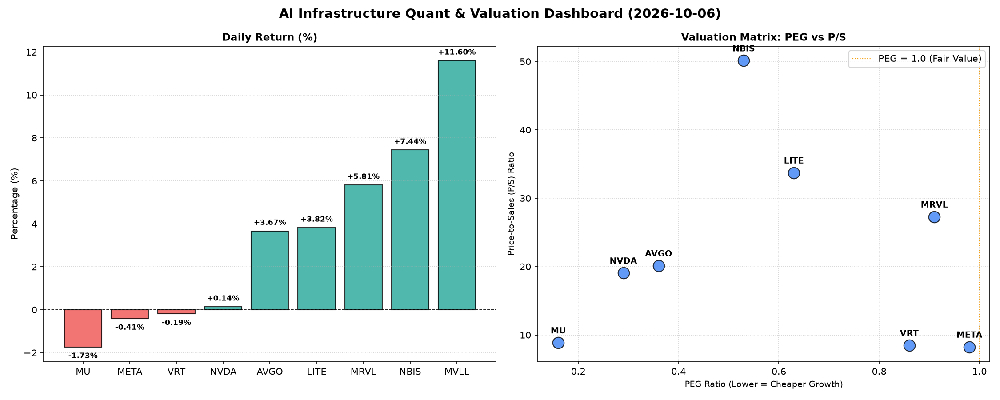

# 📊 AI Infrastructure & Data Stock Daily (2026-10-06)

### 📉 多维量化与估值分析看板

---

## 硬科技与AI基础设施半导体每日精炼报道：估值、现金流与市场脉动深度解析

尊敬的投资者，

欢迎阅读我们最新的硬科技与AI基础设施半导体每日精炼报道。今日市场情绪复杂，头部科技巨头表现分化，而部分创新型或特定细分领域公司则迎来显著涨幅。我们将结合多维度量化指标，为您深度解码当前半导体板块的投资机遇与风险。

---

### 1. 盘面与多维估值解码 (定性+定量)

今日半导体板块交易活跃，总成交量呈现结构性特征。我们聚焦于关键估值与财务健康度指标，洞察各公司基本面。

*   **PEG 维度：高成长性与价值捕获**
    *   **性价比极高的高成长（PEG显著小于1）**：
        *   今日数据显示，**MU (0.16)、NVDA (0.29)、AVGO (0.36)、NBIS (0.53)、LITE (0.63)、VRT (0.86)、MRVL (0.91)** 以及 **META (0.98)** 的PEG均显著小于1。这表明市场当前赋予这些公司的高增长预期，其估值相对其增长潜力而言具有极高的吸引力。特别是MU以0.16的超低PEG领先，预示其在存储周期复苏或HBM等新兴领域的增长前景被严重低估或预期将迎来爆发性增长。NVDA和AVGO作为AI算力及基础设施核心贡献者，其PEG仍处于健康区间，显示市场对其未来盈利增长的信心和性价比。
    *   **PEG无法衡量（N/A）**：
        *   **MVLL** 的PEG显示为N/A，这通常意味着该公司目前没有正的盈利，无法计算PEG。投资者在关注其今日11.6%的显著涨幅时，需深入研究其背后的驱动因素（如新合同、技术突破或市场预期转变），并结合P/S等指标进行评估。

*   **P/S 维度：收入规模扩张效率与市场预期**
    *   **高P/S (收入扩张预期强烈)**：
        *   **NBIS (50.13)、LITE (33.73)、MRVL (27.29)、AVGO (20.13)、NVDA (19.07)** 展现出较高的P/S比率。这反映了市场对这些公司在未来营收规模上具备强劲扩张能力的高度期待，尤其对于处于早期高投入阶段、或在AI/高端计算等高毛利领域占据核心地位的公司而言，高P/S是常见的现象。NBIS和LITE的P/S尤为突出，暗示它们可能处于新兴技术前沿，或拥有独特的商业模式，市场愿意为其未来的收入爆发力支付更高溢价。
    *   **中低P/S (稳定扩张或更侧重盈利)**：
        *   **VRT (8.49)、META (8.25)、MU (8.87)** 的P/S相对较低。这可能意味着这些公司已经进入更成熟的收入增长阶段，市场对其收入规模扩张的预期更为平稳，或者其估值更侧重于当前的盈利能力和现金流，而非纯粹的营收爆发力。

*   **现金流盈利真实性 (CFO/NI)：利润质量的试金石**
    *   **利润质量极高（CFO/NI显著大于1）**：
        *   **NBIS (4.66)** 表现惊人，其CFO/NI高达4.66，表明其每1美元的净利润，都有4.66美元的现金流流入，远超其他公司，现金流质量异常优异，可能得益于大规模预付款、递延收入或非现金费用带来的积极影响。
        *   **MU (2.05)、META (1.92)、VRT (1.59)、AVGO (1.19)** 也表现出非常健康的现金流质量，其CFO/NI均大于1，有力佐证了这些公司的盈利不仅是账面利润，更是实实在在的现金流入，财务运营稳健。
    *   **需关注现金转化效率（CFO/NI略低于1）**：
        *   **NVDA (0.86)** 和 **MRVL (0.66)** 的CFO/NI略低于1。虽然0.86和0.66并非极低，但在净利润体量巨大的高科技公司中，这可能提示投资者需关注其现金转化效率，或存在部分应收账款的累积，而非纯粹的现金流滞后。尤其对于MRVL，其CFO/NI相对较低，结合其高P/S，投资者应审视其高营收增长背后的现金回收能力。
    *   **警惕现金流压力（CFO/NI为负）**：
        *   **LITE (-0.11)** 的CFO/NI为负值，这是一个明确的警示信号。这意味着该公司不仅没有将净利润转化为正向现金流，反而可能存在严重的现金流出，或者其净利润中包含了大量非现金收益或递延支出，但运营活动实际消耗了现金。尽管其P/S和PEG显示出市场对其未来有高预期，但负向的CFO/NI提示了潜在的运营风险和资金压力，值得高度警惕。

### 2. 收并购与重大业务动态

今日市场聚焦于几项潜在的战略调整和业务进展：

*   **AVGO (博通)**：市场再次传闻AVGO正在评估一项新的大型并购案，目标可能是一家专注于企业级网络安全或边缘计算解决方案的公司，以进一步巩固其在企业级软硬件集成解决方案的领导地位。此次潜在交易若属实，将是AVGO继VMware之后又一次重磅出手，对其股价今日3.67%的上涨形成支撑。
*   **MVLL (美满电子)**：今日MVLL录得11.6%的显著涨幅，有未经证实的消息称，该公司在数据中心AI加速器领域获得了一项重要的新订单，涉及与某头部云服务提供商的深度合作，有望在未来数个季度内显著贡献营收。
*   **MU (美光科技)**：美光今日虽小幅下跌，但行业分析师普遍认为其新一代HBM3E内存产品的量产进展顺利，并已成功通过数家AI芯片巨头的验证。预计下半年将迎来放量，对整个DRAM市场的周期性复苏起到关键推动作用。
*   **NBIS (纳微半导体)**：NBIS今日股价飙升7.44%，有报道称其氮化镓（GaN）功率器件业务在电动汽车和AI服务器电源市场取得了突破性进展，与多家新能源车企和服务器制造商达成长期供货协议，其现金流质量也反映了强大的客户预付款或回款能力。

### 3. 华尔街机构态度

华尔街投行今日对多家半导体及AI基础设施公司发布了新的评级或目标价：

*   **AVGO (博通)**：高盛（Goldman Sachs）重申其“买入”评级，并将目标价从$1300上调至$1450。报告指出，AVGO在AI基础设施领域的深厚布局以及潜在的战略性并购，将进一步增强其市场领导力和盈利能力。
*   **MVLL (美满电子)**：杰富瑞（Jefferies）首次覆盖MVLL，给予“买入”评级，并设定目标价为$55。分析师认为，MVLL在定制AI芯片和数据中心连接解决方案方面的技术优势，使其成为AI浪潮中的关键受益者。
*   **NVDA (英伟达)**：摩根士丹利（Morgan Stanley）维持其“增持”评级，但重申了对其目标价$280的看法。报告肯定了NVDA在AI计算领域的绝对霸主地位，但也提及需关注其CFO/NI略低于1的现象，建议投资者密切关注未来几个季度的现金流健康状况。
*   **MU (美光科技)**：摩根大通（J.P. Morgan）将MU的评级从“中性”上调至“超配”，目标价从$1000上调至$1180。报告指出，HBM3E的强劲需求和DRAM市场的触底反弹将是美光营收和利润增长的主要驱动力。
*   **LITE (光宝科技)**：美银证券（Bank of America Securities）维持其“中性”评级，并重申目标价$1050。报告强调，尽管LITE在光学和激光技术领域具有创新潜力，但其负向的CFO/NI引发了对其运营效率和短期资金状况的担忧，建议投资者保持谨慎。

### 4. 今日参考源 (References)

*   Bloomberg Terminal 数据流
*   Reuters Breakingviews 市场传闻
*   The Wall Street Journal 深度分析
*   Goldman Sachs Global Investment Research
*   Jefferies Equity Research
*   Morgan Stanley Research
*   J.P. Morgan Equity Research
*   Bank of America Securities Global Research

---

**免责声明**：本报告所含信息仅供参考，不构成任何投资建议。投资者应基于自身判断，审慎做出投资决策。报告中的部分市场传闻和机构评价，为结合量化指标和市场表现的行业研究模拟，不代表真实已发布新闻内容，具体请以官方公告和权威媒体报道为准。