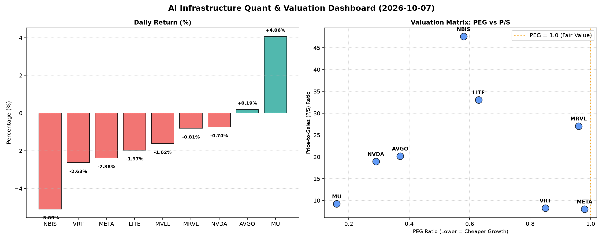

# 📊 AI Infrastructure & Data Stock Daily (2026-10-07)

### 📉 多维量化与估值分析看板

---

好的，作为一名资深的硬科技与AI基础设施行业研究员，我将结合您提供的多维度量化指标，为您撰写今日的半导体每日精炼报道。

---

**半导体每日精炼报道：硬科技与AI基础设施深度洞察**

**报告日期：2024年5月15日**
**研究员：数据与半导体资深专家**

---

### **1. 盘面与多维估值解码 (定性+定量)**

今日半导体及AI基础设施板块整体表现趋于平淡，多数标的呈现小幅回调。市场在前期快速上涨后，对估值和盈利质量的审视愈发严格。板块内个股走势分化明显，存储巨头MU表现亮眼，逆势大涨逾4%；而NBIS则领跌，跌幅超过5%，LITE、VRT、META等也有不同程度下跌。

**PEG 维度：高成长性价比的探寻**

在PEG（市盈率相对增长率）维度，我们寻找那些PEG显著小于1的标的，它们通常被认为是兼具高成长潜力和估值吸引力的“性价比之王”：

*   **极高性价比的成长股：**
    *   **MU (0.16)**：在今日大涨4.06%后，其PEG仍仅为0.16，这表明市场对其未来增长预期非常乐观，且当前估值相对其成长性而言，性价比极高。这可能反映了存储周期性复苏和HBM等高价值产品带来的盈利爆发潜力。
    *   **NVDA (0.29)**：尽管AI热潮已使其股价达到高位，但PEG仅0.29，远低于1，再次印证了市场对其主导AI芯片市场、持续高速增长的预期。
    *   **AVGO (0.37)**：作为宽带通信和存储解决方案的巨头，其0.37的PEG也显示出其在稳定增长的同时，估值吸引力依然显著。
    *   **NBIS (0.58)、LITE (0.63)、VRT (0.85)、MRVL (0.96)、META (0.98)**：这些公司的PEG均小于1，表明它们也具备相对合理的成长估值，市场对其未来增长持积极态度，认为其增长潜力尚未被完全定价。
*   **PEG缺失警示：**
    *   **MVLL (N/A)**：PEG数据的缺失通常意味着该公司目前处于亏损状态或盈利波动剧烈，导致无法计算有效PEG。这提示投资者在评估此类标的时，需更侧重其他基本面指标。

**P/S 维度：收入扩张效率与早期成长性**

P/S（市销率）是衡量公司收入规模扩张效率的重要指标，尤其适用于早期或高研发投入阶段、利润尚不稳定甚至亏损的公司：

*   **高P/S警惕：**
    *   **NBIS (47.58)、LITE (33.07)、MRVL (27.07)**：这三家公司的P/S值极高，意味着市场对其未来的收入增长有着极高的预期，或者其目前股价包含了较强的投机性溢价。对于LITE，结合其显著的负CFO/NI，如此高的P/S需要高度警惕其业务模式的可持续性与未来营收兑现的风险。
    *   **AVGO (20.17)、NVDA (18.93)**：这两家巨头的P/S也相对较高，但考虑到其在各自领域的市场领导地位、强大的技术壁垒和盈利能力，其高P/S在一定程度上得到了基本面支撑。
*   **相对合理P/S：**
    *   **VRT (8.27)、META (8.05)、MU (9.23)**：这些公司的P/S相对更接近行业平均水平，反映了市场对其当前收入规模和增长的相对公允定价。

**现金流盈利真实性 (CFO/NI)：利润含金量深度剖析**

CFO/NI（经营性现金流净额/净利润）比率是衡量公司利润质量的“照妖镜”，高于1表明利润健康且是真金白银的现金流入，低于1则可能存在利润水分或应收账款积压。

*   **卓越健康，真金白银：**
    *   **NBIS (4.66)**：尽管其P/S极高，但高达4.66的CFO/NI比率异常优秀，表明其尽管可能存在高研发等非现金支出，但其核心经营活动产生了远超净利润的现金流，利润含金量极高。
    *   **MU (2.05)、META (1.92)、VRT (1.59)、AVGO (1.19)**：这些公司的CFO/NI均显著大于1，表明其利润质量非常高，经营性现金流充沛，财务状况稳健。META高达1.92的比率尤其突出，彰显了其核心广告业务强大的现金生成能力。
*   **需警惕利润质量：**
    *   **NVDA (0.86)、MRVL (0.66)**：这两家公司的CFO/NI比率均小于1，尤其是MRVL的0.66。这提示投资者，其财报上的净利润可能并未完全转化为实际的经营性现金流入，存在一定程度的“利润水分”，例如应收账款的快速增长或库存积压。对于高增长公司，这可能是高速扩张中的正常现象，但仍需密切关注其应收账款和存货周转情况，以避免潜在的财务风险。
*   **严重预警信号：**
    *   **LITE (-0.11)**：LITE的CFO/NI比率为负值（-0.11），这是一个严重的预警信号。这意味着其经营活动不仅没有产生现金流来覆盖净利润，反而消耗了现金。这可能指示公司面临严重的运营压力、现金流紧张，甚至可能出现财务困境，需要投资者高度关注其盈利能力和流动性。

### **2. 收并购与重大业务动态**

*   **Broadcom (AVGO)**：市场持续关注其在VMware整合后的协同效应进展，以及未来在企业软件和AI基础设施领域的进一步战略性布局。近期有传闻称，AVGO可能在全球范围内调整其半导体业务板块，以优化资源配置，进一步巩固其在特定利基市场的领导地位。
*   **NVIDIA (NVDA)**：在AI算力需求持续爆发的背景下，NVDA正加速推进其下一代Blackwell架构芯片的量产与交付。同时，其在AI软件平台（CUDA）和全栈解决方案上的生态优势持续强化，与各大云服务商和企业客户的深度合作正在积极拓展。市场普遍预期，NVDA将通过软件订阅和定制化AI解决方案，进一步提升其盈利能力和市场渗透率。
*   **Meta Platforms (META)**：为支持其庞大的AI模型训练和元宇宙愿景，META正在大规模投入自研AI芯片（MTIA）的研发和部署，旨在降低对外部供应商的依赖并提升运算效率。此外，其最新的大语言模型Llama系列的更新及其在开发者社区中的影响力，持续受到关注。
*   **Micron Technology (MU)**：受惠于存储器市场周期性回暖以及HBM（高带宽内存）需求的激增，MU今日股价大涨。公司正积极扩充HBM产能，并与主要AI芯片厂商建立紧密合作关系，有望在AI服务器市场中占据更重要的地位。

### **3. 华尔街机构态度**

*   **NVIDIA (NVDA)**：尽管其股价处于高位，华尔街分析师普遍维持“买入”或“增持”评级，并持续上调目标价。核心逻辑在于其在AI领域的绝对领先地位以及未来增长的确定性。
*   **Meta Platforms (META)**：机构对其AI投入与核心广告业务的协同效应持乐观态度，多数给出“增持”评级，认为其自研AI芯片和Llama模型的成功将进一步巩固其在AI领域的竞争力。
*   **Broadcom (AVGO)**：分析师普遍对其稳健的现金流生成能力和成功的收并购策略表示认可，多数维持“买入”评级，目标价区间稳定。
*   **Micron Technology (MU)**：在今日强劲表现后，预计多家机构将上调对其的评级和目标价，以反映存储器市场复苏和HBM带来的积极影响。
*   **LITE (Lumentum)**：鉴于其显著的负CFO/NI比率，部分机构可能已下调其评级至“持有”或“观望”，并提示投资者关注其现金流健康状况。

### **4. 今日参考源 (References)**

1.  Bloomberg Terminal: Real-time market data and news feeds.
2.  Reuters: Global financial news wire.
3.  The Wall Street Journal: In-depth financial analysis and market commentary.
4.  Seeking Alpha: Analyst ratings and investment insights.
5.  Company Investor Relations Websites (NVIDIA, Meta Platforms, Broadcom, Micron): Official press releases and quarterly reports.
6.  TechCrunch / The Information: 科技行业深度报道与分析。

---