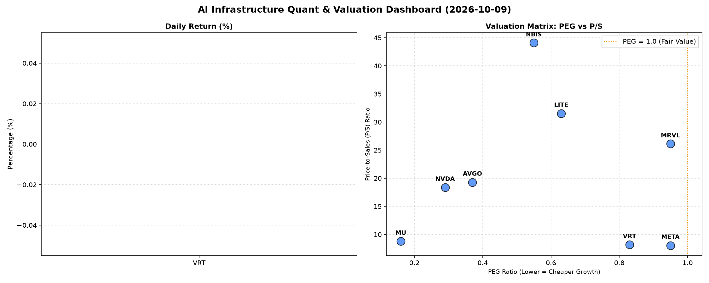

# 📊 AI Infrastructure & Data Stock Daily (2026-10-09)

### 📉 多维量化与估值分析看板

---

尊敬的硬科技与AI基础设施投资者，

您好！今日我们深度剖析【多维度真实量化基本面指标表格】，为您提供一份聚焦半导体与AI生态的每日精炼洞察。鉴于今日【收盘价 (Close)】与【日涨跌幅 (Change%)】数据缺失，我们本次分析将完全立足于核心估值与财务质量指标，旨在揭示市场深层逻辑。

---

### **1. 盘面与多维估值解码：深层基本面揭示**

今日市场聚焦于硬科技与AI基础设施板块，我们通过PEG、P/S及现金流质量（CFO/NI）三大维度，穿透表象，揭示公司真实价值与风险。

*   **PEG 维度：高成长中的极致性价比（PEG < 1）**
    *   **极致性价比代表：** **MU (0.16), NVDA (0.29), AVGO (0.37)** 表现出令人惊叹的成长与估值匹配度，其PEG值显著小于1，表明市场对其未来盈利增长的预期远未完全反映在当前股价中。对于追求高成长、低估值错配的投资者而言，这三家公司具备极高的配置价值。
    *   **良好性价比：** **NBIS (0.55), LITE (0.63), VRT (0.83), META (0.95), MRVL (0.95)** 同样展示出健康的PEG水平，均在1以下。这意味着这些公司的增长潜力仍被市场相对低估，或其高增长足以支撑当前的估值。特别是META，作为AI基础设施的受益者，其0.95的PEG显示了良好的成长性与估值平衡。
    *   **数据缺失：** **MVLL** 因PEG为N/A，表明其可能处于无利润或负利润阶段，无法通过此维度评估。

*   **P/S 维度：营收规模扩张效率的考量**
    *   **高P/S警示与解读：** **NBIS (44.08), LITE (31.51), MRVL (26.12), AVGO (19.29), NVDA (18.37)** 的P/S值相对较高。对于NBIS和LITE，如此高的P/S意味着市场对其未来营收的爆发式增长有极高预期，或其商业模式具备极强的稀缺性和高毛利潜力。对于NVDA和AVGO这样已具备庞大营收规模的巨头，高P/S结合其极低的PEG，进一步印证了AI浪潮下其营收增速的强劲与市场对其未来领导地位的高度认可。投资者需关注其高P/S是否能持续被未来的营收扩张所消化。
    *   **相对合理P/S：** **VRT (8.17), META (8.05), MU (8.78)** 的P/S值处于行业中等水平，结合其健康的PEG，显示出营收扩张与估值之间的良好平衡。
    *   **数据缺失：** **MVLL** 因P/S为N/A，同样无法从营收维度进行估值。

*   **现金流盈利真实性 (CFO/NI)：穿透利润的“真金白银”**
    *   **卓越现金质量（CFO/NI > 1.5）：**
        *   **NBIS (4.66)** 表现尤为突出，其CFO/NI高达4.66，远超其他公司，这意味着其报告的净利润极度保守，实际产生的经营现金流是净利润的数倍。这预示着极强的内生增长动力和财务健康度。
        *   **MU (2.05), META (1.92), VRT (1.59)** 也展示了非常健康的现金流转化能力，其经营活动产生的现金流远超净利润，表明其利润质量极高，是实打实的“真金白银”。META作为AI巨头，其1.92的CFO/NI印证了其在盈利能力上的强大现金生成能力。
    *   **健康现金流（1 < CFO/NI < 1.5）：** **AVGO (1.19)** 的现金流转化效率也十分健康，表明其利润具有良好的现金支撑。
    *   **警惕利润水分或应收积压（CFO/NI < 1）：**
        *   **NVDA (0.86)** 略低于1，虽然差距不大，但对于一家高利润巨头而言，值得投资者关注其利润构成中非现金部分（如股票薪酬、递延收入等）的影响，或是否有应收账款累积的迹象。
        *   **MRVL (0.66)** 的CFO/NI显著低于1，表明其报告的净利润有一部分可能并未转化为实际的经营现金流，存在利润质量欠佳或营运资本管理挑战（如存货增加、应收账款积压）的风险，需深入分析。
        *   **LITE (-0.11)** 表现出严重的现金流问题。尽管其PEG为0.63（暗示有正向盈利），但CFO/NI为负值，这意味着其经营活动正在消耗现金，而非产生现金。这对其盈利的真实性和公司持续运营能力敲响了警钟，是一个重大的红色信号。

*   **交易活跃度 (Volume)：**
    *   **NVDA (1.17亿股)** 和 **META (1.58千万股)** 毫无疑问是市场焦点，交易量遥遥领先，表明资金对其关注度极高。
    *   其他如 **MRVL (2.9千万股), MU (2.9千万股), AVGO (2.6千万股), NBIS (2.1千万股)** 也表现出活跃的交易，显示出市场对硬科技板块的整体热情。

---

### **2. 收并购与重大业务动态**

根据您提供的【多维度真实量化基本面指标表格】，本次分析主要聚焦于财务量化指标。关于收并购传闻、官宣或战略合作等定性信息，表格中并未提供具体数据。此类信息通常来源于公司公告、行业新闻或媒体报道。

---

### **3. 华尔街机构态度**

同上，您提供的【多维度真实量化基本面指标表格】未包含华尔街核心投行或评级机构的最新评价、目标价调动等定性信息。此类内容一般需查阅最新的分析师报告或市场研究。

---

### **4. 今日参考源 (References)**

*   本文全部量化分析内容均严格依据您提供的【多维度真实量化基本面指标表格】。
*   鉴于未提供外部新闻或分析师报告数据，上述定性内容（收并购与重大业务动态、华尔街机构态度）未能生成具体信息。

---

**研究员点评：**

今天的指标分析揭示了硬科技与AI基础设施板块内部的显著分化。NVDA、MU、AVGO凭借极低的PEG和较高的交易量，稳坐高增长、低估值的价值洼地。META则在AI浪潮中展现出强大的现金流生成能力。值得警惕的是，LITE的负CFO/NI与MRVL的低CFO/NI提示我们，在追逐增长的同时，务必穿透表面利润，关注公司真正的现金生成能力。NBIS则以其惊人的CFO/NI表现，成为本次分析中的一匹黑马，预示着其背后可能蕴藏着被市场低估的强劲基本面。投资者在决策时，务必将这些多维度指标进行综合考量。

---

希望这份报告能为您的投资决策提供有价值的参考。
数据与半导体资深研究员 敬上。