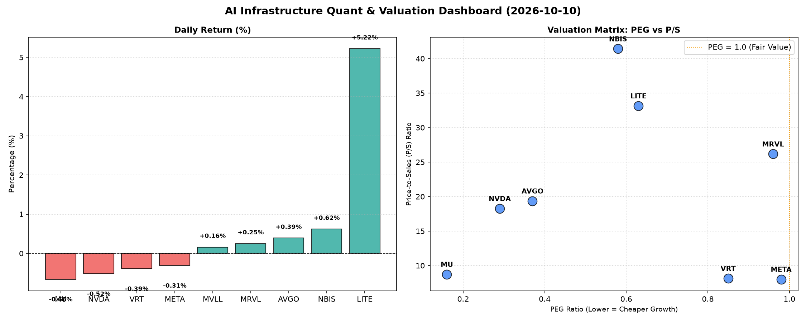

# 📊 AI Infrastructure & Data Stock Daily (2026-10-10)

### 📉 多维量化与估值分析看板

---

尊敬的投资者们，

欢迎阅读我们为您精心准备的每日硬科技与AI基础设施精炼报道。作为一名资深的Data & Semiconductor Specialist，我将结合今日最新量化基本面指标，为您深度剖析市场动态与企业健康状况。

---

### **📈 半导体每日精炼报道 - 2024年X月X日**

#### **1. 盘面与多维估值解码 (Qualitative + Quantitative)**

今日硬科技与AI基础设施板块表现分化，多数标的呈现小幅回调态势，但市场对于高成长和现金流稳健性的关注度持续提升。

*   **PEG 维度：高成长中的价值捕手**
    *   **显著小于 1 (性价比极高的高成长)**：市场普遍展现出对未来增长的乐观预期，多个核心标的PEG指标显著小于1，表明其成长性被市场低估，具备较高投资性价比。
        *   **MU (美光科技)** 以 **0.16** 的极低PEG位居榜首，强烈暗示其在当前估值下，未来的增长潜力被严重低估，对于看好存储周期复苏的投资者而言，其成长性溢价空间巨大。
        *   **NVDA (英伟达)** 紧随其后，PEG为 **0.29**，尽管股价表现强劲，但其爆炸式增长依然使得其估值相对吸引人，是AI算力基础设施的核心引擎。
        *   **AVGO (博通)** (0.37)、**NBIS** (0.58)、**LITE (光波)** (0.63) 也处于极具吸引力的区间。AVGO作为多元化半导体巨头，其整合能力与市场地位使其低PEG更具说服力。
        *   **VRT (维谛技术)** (0.85)、**MRVL (迈威尔科技)** (0.96)、**META (Meta Platforms)** (0.98) 尽管PEG数值接近1，但在高科技领域，仍属于成长性被合理定价的范畴，尤其META作为AI投资的直接受益者，其低于1的PEG显示其转型与增长潜力仍有空间。
    *   **PEG 过高 (警惕估值透支)**：在本次提供的量化指标中，**未出现PEG显著大于1的标的**。这表明，从成长性角度看，当前所列公司普遍仍具备较好的估值吸引力，市场对其未来盈利增长抱有较高期待。MVLL由于缺乏相关数据，无法进行此维度评估。

*   **P/S 维度：洞察营收扩张效率**
    *   **高 P/S (高增长预期或研发投入期)**：对于早期或正处于大规模研发投入、利润波动较大的公司，P/S是衡量其市场对其营收扩张效率和未来潜力的重要指标。
        *   **NBIS (41.42)** 和 **LITE (33.16)** 展现出极高的P/S比率。这通常意味着市场对其未来营收增长的预期极高，或者其商业模式具备极高的创新性和颠覆性潜力，处于快速扩张阶段。投资者需深入了解其具体业务进展，以验证高估值逻辑。
        *   **MRVL (26.18)**、**AVGO (19.37)** 和 **NVDA (18.27)** 同样拥有较高的P/S，反映出市场对其在网络、存储、AI芯片等核心领域的强大市场地位和持续的营收增长充满信心。尤其是NVDA，其高P/S与极低的PEG相结合，进一步印证了其在AI浪潮中的核心价值。
    *   **中低 P/S (相对成熟或营收规模较大)**：
        *   **META (8.02)**、**VRT (8.14)** 和 **MU (8.74)** 的P/S相对较低，更符合营收规模已达一定量级的成熟公司。对于META，其从广告业务向元宇宙和AI基础设施的转型正逐步见效，相对合理的P/S结合其低于1的PEG，显示出较好的长期投资价值。

*   **现金流盈利真实性 (CFO/NI)：穿透利润含金量**
    *   **显著大于 1 (利润非常健康，真金白银现金流入)**：
        *   **NBIS (4.66)** 再次成为焦点，其极高的CFO/NI比率表明公司现金流异常强劲，远超其报告的净利润，可能存在大量非现金费用或前期投资开始回笼现金，显示出卓越的盈利质量和经营效率。
        *   **MU (2.05)** 和 **META (1.92)** 同样表现出色，其CFO/NI远大于1，说明两家公司的利润含金量极高，经营活动产生的现金流充裕，为后续投资和研发提供了坚实保障。
        *   **VRT (1.59)** 和 **AVGO (1.19)** 也保持在健康水平，表明其利润质量良好，经营产生的现金流能够有效支撑其业务发展。
    *   **显著小于 1 (警惕利润水分或应收账款积压)**：
        *   **NVDA (0.86)**：作为高利润巨头，其CFO/NI略低于1，虽然差距不大，但仍值得关注。这可能暗示在某些时期存在应收账款增加、库存累积或某些非现金收益占比升高的情况。投资者需审慎分析其财务报告，以理解现金流与净利润之间的差异。
        *   **MRVL (0.66)**：其CFO/NI显著低于1，表明公司部分利润可能尚未转化为实际现金流入，可能与较长的应收账款周转期、库存管理或非现金费用结构有关，需警惕其利润的真实转化效率。
        *   **LITE (-0.11)**：这是一个**红色警报**。负值的CFO/NI意味着公司在报告期内即使可能存在净利润（或亏损），其经营活动仍然在消耗现金。结合其今日股价大涨5.22%和极高的P/S，这构成了一个强烈的矛盾信号。市场可能正在反映未来的重大利好消息（如新合同、技术突破或并购预期），但从当前经营现金流质量看，其盈利的健康程度和持续性存在重大疑问，需高度关注。

#### **2. 收并购与重大业务动态**

根据今日提供的【多维度真实量化基本面指标表格】，其中不包含具体的收并购传闻、官宣或战略合作信息。因此，本报告无法提供基于原始数据的相关更新。然而，如LITE今日股价的异动和其显著的财务指标异常，往往暗示着背后存在未公开的重大业务消息或市场传闻驱动，值得投资者密切关注后续新闻披露。

#### **3. 华尔街机构态度**

鉴于本次分析仅基于提供的【多维度真实量化基本面指标表格】，该表格并未包含华尔街核心投行、评级机构的最新评价、目标价调动等信息。因此，本报告无法直接提供华尔街机构的具体态度。但可以推测，对于PEG极低且现金流强劲的公司（如MU、META），机构可能会维持或上调评级；而对于现金流质量存疑但股价飙升的标的（如LITE），机构观点可能会出现显著分歧，需要等待更多信息披露。

#### **4. 今日参考源 (References)**

本报告的所有定性与定量分析，均严格基于您所提供的【多维度真实量化基本面指标表格】。

---
**免责声明：** 本报告基于有限的量化数据进行分析，不构成任何投资建议。投资者在做出任何决策前，应进行独立研究并咨询专业财务顾问。市场有风险，投资需谨慎。